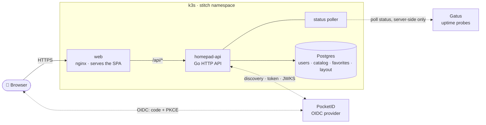

<p align="center">
  
</p>

<p align="center">
  
  
  
  
  
</p>

# homepad

**homepad** is a self-hosted launcher / homepage for a homelab: one page that
lists every service in a shared catalog, shows a **live status badge** for each
(UP / DEGRADED / DOWN / UNKNOWN), and lets each user keep their own favorites and
tile order. Status data is pulled server-side from [Gatus](https://github.com/TwiN/gatus) —
the browser never talks to Gatus directly.

This repo is the **web frontend** (React + Vite + TypeScript + Tailwind). It
pairs with the Go backend at [`Code/homepad-api`](https://gitea.kube.calebdunn.tech/Code/homepad-api).

> **Spec:** [`specs/v1-launcher.md`](./specs/v1-launcher.md) — canonical for both repos.
> **Test plan:** [`specs/test-plan-v1.md`](./specs/test-plan-v1.md)

## Features

- **Two ways to log in** — local email + password (bcrypt sessions), *and*
  "Log in with PocketID" (homelab OIDC) when the backend has it enabled. The
  OIDC button is additive and fails closed (hidden) if OIDC is off.
- **Shared service catalog** — every authenticated user sees the same tiles
  (name, icon, description, launch URL), rendered in the order the API returns.
- **Live status badges** — each tile shows UP (green) / DEGRADED (amber) /
  DOWN (red) / UNKNOWN (gray), driven by the backend's Gatus poller (status is
  never staler than ~60s).
- **Per-user favorites** — star a service; favorites persist across sessions
  (optimistic toggle with rollback on failure).
- **Personal ordering** — reorder your tiles with move up / down; the order is
  saved per user and survives logout (optimistic + rollback).
- **Admin catalog CRUD** — admins create / edit / delete catalog entries;
  non-admins get a 403.
- **Gatus is server-side only** — no Gatus URL ever ships in the JS bundle or
  reaches the browser (verified: `grep -ri gatus dist/` is empty).

Acceptance criteria **A1–A11** from the spec are all implemented; A7/A8 (live
responsive + Lighthouse budgets) and full browser e2e are verified on the
deployed stack.

## Architecture



The browser only ever talks to `web` (the SPA) and, same-domain, to `/api/*`.
Gatus is reachable **only** from the backend poller — never from a browser
session (spec AC A11).

## Authentication

Both login paths land on the **same** `homepad_session` cookie, so the rest of
the app is identical regardless of how you signed in.

```mermaid
sequenceDiagram
  autonumber
  participant B as Browser
  participant A as homepad-api
  participant P as PocketID (OIDC)
  participant DB as Postgres

  rect rgb(15,23,42)
  note over B,DB: Local — email / password
  B->>A: POST /api/login (email, password)
  A->>DB: look up user, verify bcrypt hash
  A-->>B: Set-Cookie homepad_session → 200
  end

  rect rgb(2,6,23)
  note over B,P: PocketID — Authorization Code + PKCE
  B->>A: GET /api/auth/oidc/login
  A-->>B: 302 → PocketID authorize<br/>(state, nonce, PKCE S256 challenge)
  B->>P: authorize + consent
  P-->>B: 302 → /api/auth/oidc/callback?code&state
  B->>A: GET /api/auth/oidc/callback?code&state
  A->>P: exchange code + PKCE verifier → tokens
  P-->>A: id_token (+ JWKS for verify)
  A->>A: verify RS256 sig · iss / aud / exp / nonce
  A->>DB: link-by-email or provision user<br/>(admin iff in OIDC_ADMIN_GROUP)
  A-->>B: Set-Cookie homepad_session → 302 /
  end
```



`GET /api/auth/config` returns `{"oidcEnabled":bool}` so the web app knows
whether to render the PocketID button. When OIDC is disabled the two `/oidc/*`
endpoints are unregistered (404) and homepad is local-only.

## Screenshots

> Wireframe placeholders — replaced with real captures from the live deploy.

| Login (local + PocketID) | Catalog with live status |
| --- | --- |
|  |  |

<p align="center">
  
  <br><em>Responsive at 390×844 (iPhone 13)</em>
</p>

## Layout

```
src/                React app (App, Catalog, api client) + Vitest specs
tests/e2e/          Playwright specs, one per acceptance criterion
specs/              Source-of-truth spec + test plan (lives in this repo)
docs/               README assets (banner, screenshots)
lighthouserc.cjs    Lighthouse CI thresholds (AC A8)
```

## Run locally

```bash
npm install
npm run dev          # vite dev server on :5173, proxies /api → :8080
```

For the full app to do anything useful, also run `Code/homepad-api` locally
(`make run`).

## Test

```bash
npm test                       # Vitest component/unit suite (44 tests)
npm run test:e2e:install       # one-time Playwright browsers
npm run test:e2e               # full E2E suite (desktop + mobile)
npm run build && npm run lhci   # Lighthouse perf budgets (AC A8)
```

## Deploy

K8s manifests are owned by Joe (homie / SRE bot), not in this repo. This repo ships:

- `Dockerfile` (multi-stage Vite build → nginx static serve)
- `nginx.conf` (SPA fallback + caching headers)
- The "Deployment contract" section in [`specs/v1-launcher.md`](./specs/v1-launcher.md)

Same-domain path routing: `homepad.calebdunn.tech/` → this app,
`homepad.calebdunn.tech/api/*` → `homepad-api`.
